# Django REST framework 1

> ## API (Appliction Programming Interface)
> 클라이언트-서버처럼 서로 다른 프로그램에서 요청과 응답을 받을 수 있도록 만든 체계
>
> ex) 전자제품을 코드를 꽂으면 작동하는 것처럼 우리가 전기가 작동하는 원리까지 알 필요없이 간단하게 사용할 수 있도록 해주는 것

</br>

> ## REST (Representational State Transfer)
> API Server를 개발하기 위한 일종의 소프트웨어 설계 방법론 "약속, 제안" (규칙X)
>
> 각각 API 구조를 작성하는 모습이 너무 다르니 약속을 만들어서 다같이 통일해서 쓰자!
>
> **자원을 정의**하고 **자원에 대한 주소**를 지정하는 전반적인 방법을 서술

</br>

- ### REST에서 자원을 정의하고 주소를 지정하는 방법
  1. 자원의 식별 ( URI )
  2. 자원의 행위 ( HTTP Methods-GET,POST )
  3. 자원의 표현 ( JSON데이터, 궁극적으로 표현되는 데이터 결과물 )
</br>


> ## 1. 자원의 식별

### URI (Uniform Resorce Identifier) 통합 자원 식별자
인터넷에서 리소스(자원)를 식별하는 문자열
ex) URL - 웹주소  (URI > URL)

### URL (Uniform Recource Locator) 통합자원위치
: 웹에서 주어진 리소스의 주소, 네트워크 상에 리소스가 어디 있는지를 알려주기 위한 약속

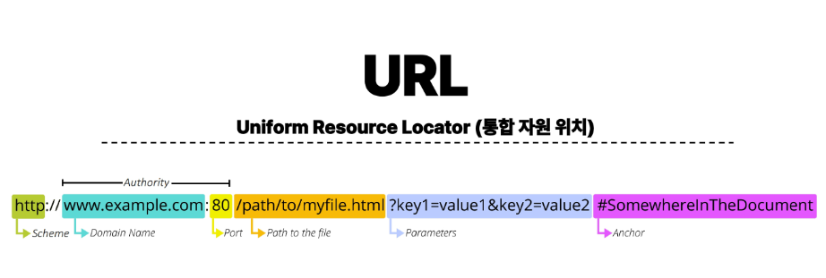

</br>

> ### URL 사용약속
1. Schema ( or Protocol )
   - 브라우저가 리소스를 요청하는 데 사용해야 하는 규약
   - URL 첫 부분은 브라우저가 어떤 규약을 사용하는지를 나타냄
   - 기본적으로 웹은 HTTP(S)를 요구하며 메일을 열기위한 mailto:, 파일을 전송하기 위한 ftp:등 다른 프로토콜도 존재 (내부적으로 사용)
  
2. Domain Name
   - 요청중인 웹 서버를 나타냄
   - 어떤 웹 서버가 요구되는 지를 가리키며 직접 IP주소를 사용하는 것도 가능하지만, 외우기 어렵기때문에 주로 도메인네임으로 사용
   - ex) google.com의 IP주소는 142.251.42.142 - AWS같은곳에서 돈주고 살 수 있음

3. Port
   - 장고같은거 열때 볼 수 있었음
   - 웹 서버의 리소스에 접근하는 데 사용되는 기술적인 문(Gate)
   - HTTP 프로토콜의 표준 포트 / HTTP:80, HTTPS:443
   - 표준포트는 생략 가능
  
4. Path
   - 웹 서버의 리소스 경로
   - 초기에는 실제파일이 아닌 물리적 위치를 나타냈지만, 오늘날은 실제위치가 아닌 추상화된 형태의 구조를 표현

5. Parameters
  - ? 이후로 제공, GET method할때 배움 - 검색 데이터 넘어갈때 데이터가 parameter로 넘어감
  - 웹 서버에 제공하는 추가적인 데이터
  - & 기호로 구분되는 key-value쌍 목록

6. Anchor
  - 일종의 북마크 , 부트스트랩문서에서 '#'을 누르면 정확한 그 위치를 보여줌
  - '#'이후는 서버에 전송되지않고, 해당지점으로 이동할수 있도록만 함

</br>

> ## 2. 자원의 행위

</br>
요청을 보낼 때 우리가 원하는 행위

- ### HTTP Request Methods
리소스에 대한 행위(수행하고자 하는 동작)를 정의, HTTP verbs라고도 함
  1. GET (Read - 조회)
     - 서버의 리소스 표현을 요청
     - GET을 사용하는 요청은 데이터만 검색해야함
  
  2. POST (Create - 생성)
     - 데이터를 지정된 리소스에 제출
     - 서버의 상태를 변경
  
  3. PUT (Update - 수정)
     - 요청한 주소의 리소스를 수정
  
  4. DELETE (Delete - 삭제)
     - 지정된 리소스 삭제

</br>
응답에 대한 행위

- ### HTTP response status codes
  
5개의 응답 그룹
  - 100 ~ 600 구간을 5개로 나누어 응답


</br>

> ## 2. 자원의 표현
> 지금까지 Django서버는 사용자에게 페이지만 응답하고 있었음
> 
> 하지만 서버가 응답할 수 있는것은 페이지 뿐만 아니라 다양한 데이터 타입을 응답할 수 있음
>
> REST API는 JSON 타입으로 응답하는 것을 권장

  
- 응답 데이터 타입의 변화
  1. 페이지만 응답하는 서버 (server -> (html)-> client)
  2. server -> (JSON)-> client
  3. server -> (JSON)-> client </br>
     server(장고) <- (front-end framework) <- client </br>
     장고는 더이상 template부분에대한 역할 담당X front-end back-end로 분리
  4. Django를 사용하면서 RESTfull API 서버를 구축!!


</br>
</br>
</br>

</hr>


REST API 사전준비! - 99-json-response-practice 파일로 연습

- template가 사라지고 serializers.py (form과 비슷한 모양)이 생김

- ++++ view함수 바뀜
```
# @api_view(['GET'])
@api_view()
def article_json(request):
    articles = Article.objects.all()
    serializer = ArticleSerializer(articles, many=True)
    return Response(serializer.data)
```

- 준비된 python-request-sample.py 로 json응답 받는 연습!
```
터미널 분리시켜서 새로운 것 만든 후 파일 불러오기
python-request-sample.py
```
파일 내부에서 print 찍으면서 데이터 확인하고 사용하기


> ## DRF

### Serialization (직렬화)
여러 시스템에서 활용하기 위해 데이터구조나 객체 상태를 나중에 재구성할 수 있는 포맷으로 변환하는 과정
-> 특정데이터를 여러시스템에서 활용하기 위해서 타입을 변환시켜주는 것
-> 데이터 구조나 객체상태를 나중에 재구성할 수 있는 포맷으로 변환하는 과정
ex) python - list, dict 형태 -> json

### -> 즉, Serialization을 진행해주는 Class를 만드는 것이 목적!! (model class와 비슷한 형태)


### DRF with Single Model

1. 프로젝트 준비
   1. 사전 제공된 drf 프로젝트 기반 시작
   2. 가상환경 생성, 활성화, 패키지 설치
   3. migrate 진행
   4. 준비된 json파일 load (python manage.py loaddata ~~~.json)
   5. 'rest_framework', settings에 등록

2. POSTMAN 다운로드 - api를 설계/개발할 때 쓰는 프로그램
   
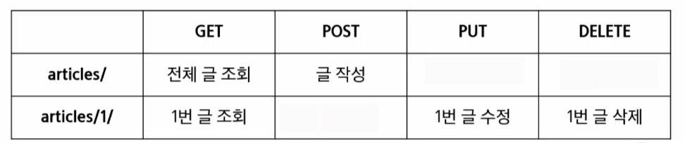

## GET - List
- 게시글 데이터 목록 조회하기
- 게시글 데이터 목록을 제공하는 ArticleListSerializer 정의
- 앱에 serializers.py 파일 생성
- rest_framework 설치할때 가상환경이 아닌 일반셋팅에서 설치해주어야 오류안남!
- ModelSerializer : 장고 모델과 연결된 Serializer Class
- url -> view 작성만 하면 됨! (template 필요X)

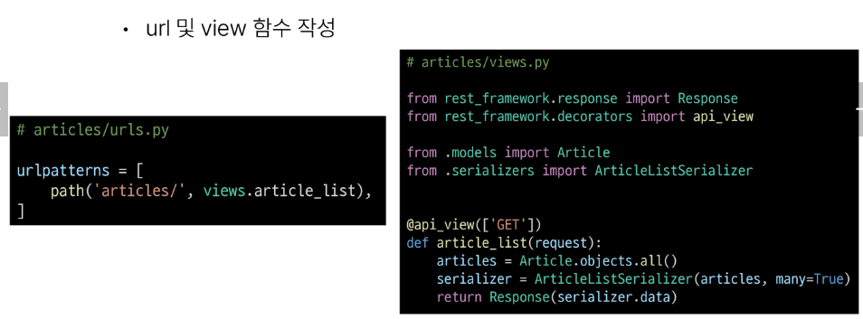

- ** DRF view함수 필수 약속 - 데코레이터가 필요함!
from rest_framework.decorators import api_view
@api_view(['GET'])

- 기본적으로 GET 메서드, 다른것으로 보내면 405오류남
- ### return Response(serializer.data) 로 return render X, request X !!
  

###  serializer = ArticleSerializer(article) 해주는 이유: 데이터를 유연하게 바꿔주기 위해!! 


## GET - Detail
- 단일 게시글 데이터 조회하기
- 각 게시글의 상세정보를 제공하는 ArticleSerializer 정의
- 단일조회할땐 fields = '__all__'  !
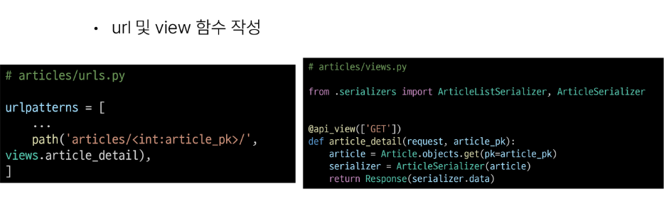
- 단일이기 때문에 article, many=True 없어도 됨
- 

## POST

### POST 게시글 데이터 생성하기
성공 -> 201 created 응답
실패 -> 400 bad request 응답

- article_list와 같은 view함수를 씀
- POST요청은 vriavble route로 들어오는게 없어서 url주소를 새로 만들 필요가 없다. -> 다른 url에서 분기처리

- rest는 url을 위치를 식별하는 것으로만 씀(위치) //but, url주소에 행위의 의미가 담겨있었음 // but, method로 표현해야함(방법론적으로..)
- => article/create 와같이 쓰지않고 그냥 article에서 메서드만 바꾸려고함!
- view함수에서 받을 때 if GET, elif POST로 씀! (else 처리X)
- ###  serializer = ArticleSerializer(data=request.data)
- serializer(form) 만들 때 serializer + data 적어주고 request.POST가 아닌 data!
- return 성공 Response(serializer.data, status=status.HTTP_201_CREATED)
- 이때 status에 .을 누르면 대표적인 응답상태코드 보임
- 실패 : Response(serializer.errors, status=status.HTTP_400_BAD_REQUEST)

```
@api_view(['GET', 'POST'])
def article_list(request):
    if request.method == 'GET':
        articles = Article.objects.all()
        serializer = ArticleListSerializer(articles, many=True)
        return Response(serializer.data)
    elif request.method == 'POST':
        serializer  = ArticleSerializer(data=request.data)
        if serializer.is_valid():
            serializer.save()
            return Response(serializer.data, status=status.HTTP_201_CREATED)
        return Response(serializer.errors, status=status.HTTP_400_BAD_REQUEST)
```

#### POSTMAN에서 DATA 보낼 때
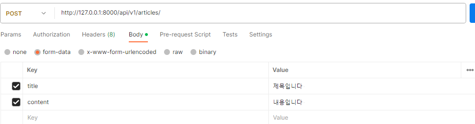
- 사용자가 create page에서 제목, 내용쓰고 보내는 것과 같은것!!
- 
-> 성공
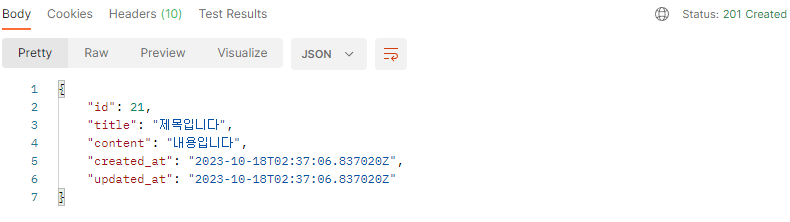

-> 실패
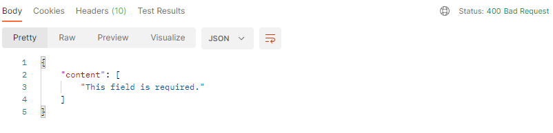


### POST 게시글 데이터 삭제하기

- article_detail과 같은 view함수를 씀
- 삭제는 serializer 가 필요 없음
  
```
@api_view(['GET', 'DELETE'])
def article_detail(request, article_pk):
    article = Article.objects.get(pk=article_pk)
    if request.method == 'GET':
        serializer = ArticleSerializer(article)
        return Response(serializer.data)
    elif request.method == 'DELETE':
        article.delete()
        return Response(status=status.HTTP_204_NO_CONTENT)
```

- 삭제 요청
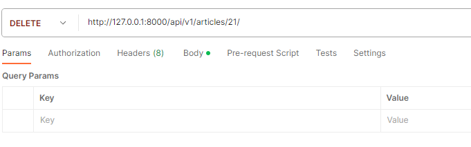

결과
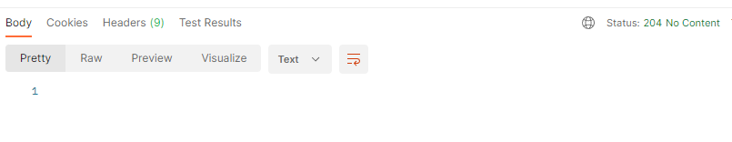

-> 204_NO_CONTENT : 잘 삭제되었음!


### POST 게시글 데이터 수정 (PUT)

- article_detail과 함수 공유
- 요청에 대한 데이터 수정이 성공했을 경우는 200 ok 응답

- 원래 form작성시 : 
- form = ArticleForm(data=request.data, instance=article)
- 

```
@api_view(['GET', 'DELETE', 'PUT'])
def article_detail(request, article_pk):
    article = Article.objects.get(pk=article_pk)
    if request.method == 'GET':
        serializer = ArticleSerializer(article)
        return Response(serializer.data)
    
    elif request.method == 'DELETE':
        article.delete()
        return Response(status=status.HTTP_204_NO_CONTENT)
    
    elif request.method =='PUT':
        serializer = ArticleSerializer(article, data=request.data)
        if serializer.is_valid():
            serializer.save()
            return Response(serializer.data)
        return Response(serializer.errors, status=status.HTTP_400_BAD_REQUEST)
```

- put test
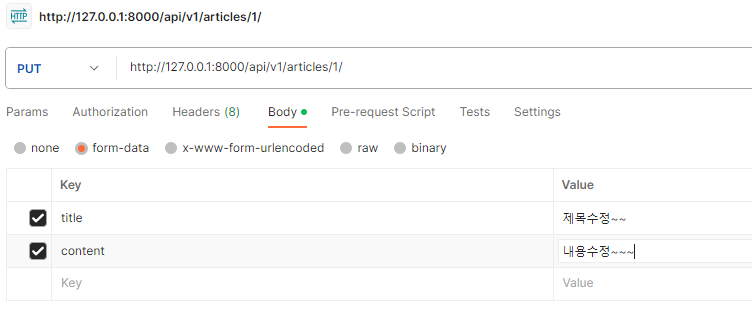

- 결과
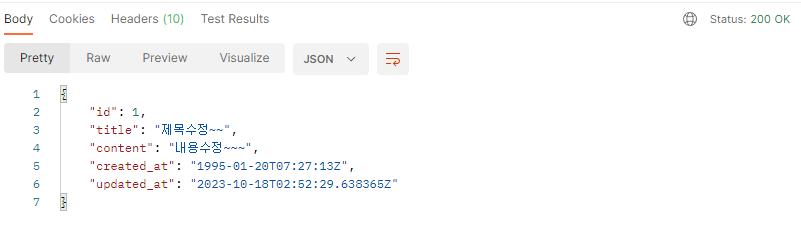


## Django restr framework or DRF 검색 - 공식문서 확인