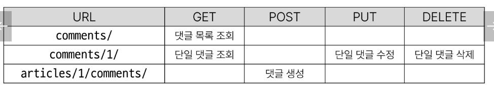
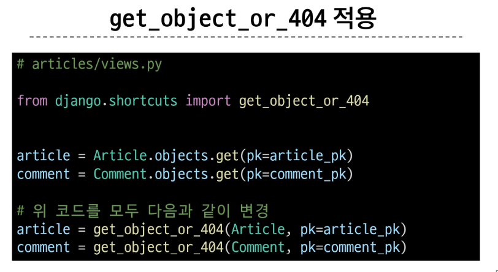
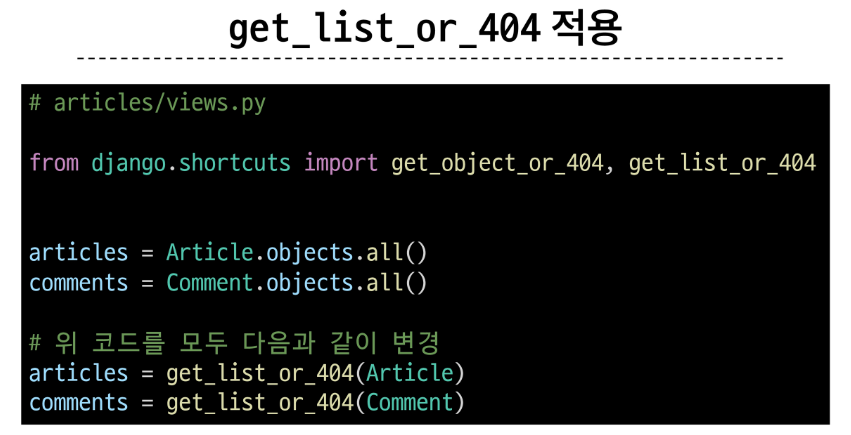

### 지난 시간 수정(PUT) 어색했던? 부분 수정

수정을 할때 제목만 수정을하거나 내용만 수정하거나 하지 못하고 둘다 같이 내용을 입력해야 내용이 수정됨
=> if serializer.is_valid() 에서 걸림 / 빈 데이터 허용X
필드 : 최종 결과물의 출력에 영향 + validation이 진행이 됨
필드가 all = is_valid에서 모든 필드를 확인하기 때문에 일부데이터 수정 불가
-> 옵션이 하나 추가되면 됨 (partial=True) / 기본이 모든 데이터에 대해서 확인함
(serializer 공식문서 확인~)


- 수정 전
```
elif request.method =='PUT':
        serializer = ArticleSerializer(article, data=request.data)
        if serializer.is_valid():
            serializer.save()
            return Response(serializer.data)
        return Response(serializer.errors, status=status.HTTP_400_BAD_REQUEST)
```

- 수정 후
```
    elif request.method == 'PUT':
        serializer = ArticleSerializer(article, data=request.data, partial=True)
        if serializer.is_valid(raise_exception=True):
            serializer.save()
            return Response(serializer.data)
        # return Response(serializer.errors, status=status.HTTP_400_BAD_REQUEST)
```
</br>
</br>


> # DRF with N:1 Relation
> 1. 댓글 목록 조회 (GET)
> 2. 단일 댓글 조회 (GET) 단일 댓글 수정 (PUT) 단일 댓글 삭제 (DELETE)
> 3. 댓글 생성 (PUT)


- N:1관계에서 외래키를 가지는쪽 = N
- Comment(N) 와 Article(1) 사이에서는 Comments!
  
  ## URL및 HTTP request method 구성
  


## 1. 댓글 목록 조회 (GET)

```
@api_view(['GET'])
def comment_list(request):
    comments = Comment.objects.all()
    serializer = CommentSerializer(comments, many=True)
    return Response(serializer.data)
```
#### 만들때 주의사항
- 다중데이터 조회(__all__)이면 many=True 옵션 넣어주기
- 데코레이터 선언 필수! @api_view([ ])

-> GET Postman에서 응답 확인 = json으로 잘 들어옴!


</br>
</br>

## 2. 단일 댓글 조회 (GET)
- pk값이 필요한것만 빼고 댓글목록조회와 비슷
```
@api_view(['GET'])
def comment_detail(request, comment_pk):
    comment = Comment.objects.get(pk=comment_pk)
    serializer = CommentSerializer(comment)
    return Response(serializer.data)
```

</br>
</br>

## 단일 댓글 수정 (PUT)
```
@api_view(['POST'])
def comment_create(request, article_pk):
    article = Article.objects.get(pk=article_pk)
    serializer = CommentSerializer(data=request.data)
    if serializer.is_valid(raise_exception=True):
        serializer.save(article=article)
        return Response(serializer.data, status=status.HTTP_201_CREATED)
```
#### 만들 때 주의사항
- if serializer.is_valid(raise_exception=True) 해주면 마지막 return 404에러가 없어도 됨
- 모델 form에서는 commit=False 를 이용해서 데이터 유효성검사 에러를 해결했었음
- 
- serializer에서는 save(commit=False)문법X
- serializer.save(article=article) 누락된 것만 넣어주기 해도 is_vaild()에서 먼저 걸림
  - 조회는 가능하면서 유효성에서 제외되는 필드 필요!! => 읽기전용필드
  - serializer에서 read_only_fields = ('예외필드', ) 넣어주기

</br>
</br>

## 단일 댓글 수정 (PUT) 단일 댓글 삭제 (DELETE)
- comment_detail 함수이용
  
```
@api_view(['GET', 'DELETE', 'PUT'])
def comment_detail(request, comment_pk):
    comment = Comment.objects.get(pk=comment_pk)
    if request.method == 'GET':
        serializer = CommentSerializer(comment)
        return Response(serializer.data)
    
    elif request.method == 'DELETE':
        comment.delete()
        return Response(status=status.HTTP_204_NO_CONTENT)

    elif request.method == 'PUT':
        serializer = CommentSerializer(comment, data=request.data)
        if serializer.is_valid(raise_exception=True):
            serializer.save()
            return Response(serializer.data)
```


</br>
</br>

> ## 데이터 재구성
> 댓글을 달 때 생기는 id값을 숫자가 아닌 title을 넣는 등 데이터를 재구성시킬 수 있음

### 댓글 조회 시 게시글 출력 내역 변경 (응답의 재구성)

- 댓글 조회 시 게시글 번호만 제공해주는 것이 아닌 '게시글의 제목'까지 제공하기 (훨씬 알아보기 쉬워짐!)

```
class CommentSerializer(serializers.ModelSerializer):
    # 클래스 안에서 새롭게 사용할 클래스를 지정해줌
    class ArticleSerializer(serializers.ModelSerializer):
        class Meta:
            model = Comment
            fields = ('title', )
            
    # override -> 기존에있던 meta의 read_only_fields가 적용되지 X
    article = ArticleSerializer(read_only=True)


    class Meta:
        model = Comment
        fields = '__all__'
        # read_only_fields = ('article', )
```
#### 만들 때 주의사항
- 클래스 안에서 새롭게 사용할 클래스(ArticleSerializer)를 지정해줌 -> 새롭게 바꾸고 싶은 필드를 지정할 클래스
- 새롭게 정의한 필드는 Meta의 read_olny 가 적용되지 않기 때문에 새롭게  article = ArticleSerializer(read_only=True) 로 지정해주어야함

- article 결과값이 int/ id값에서 딕셔너리로 변환되면서 title값 반환됨 // 다른데이터도 추가해 줄 수 있음


</br>
</br>

> ## 역참조 데이터 구성
> Article -> Comment 간 역참조 관계를 활용한 JSON 데이터 재구성
    1. 단일 게시글 조회 시 해당 게시글에 작성된 댓글 목록 데이터도 함께 붙여서 응답 (기존에 있던 comment_set 활용)
   
    2. 단일 게시글 조회 시 해당 게시글에 작성된 댓글 개수 데이터도 함께 붙여서 응답 (신규필드 생성!)


### 1. 단일 게시글 + 댓글 목록
- comment -> article 참조할 수 있지만 반대의 경우는 comment에 대한정보가 없음 -> comment_set 을 사용해주었음
- but, 물리적으로 존재하지 않기 때문에 json data에 존재 X, 우리가 만들어 주어야 함


- GET으로 article 조회 시 comment에 대한 정보가 없음 -> article클래스에는 comment에 대한 정보도 없고 외래키도 없었기 때문
- 그래서 댓글도 조회 될 수 있게 만들어 줄것임!


serializer.py 에서 ArticleSerializer를 수정해서 만들기
-> 역참조 키 comment_set과 아까 만들어 놓은 CommentSerializer 클래스를 이용
- 이때, 우리는 1에서 N쪽을 참조하고 있는 것임
- comment의 결과는 N!!
  - 다중데이터 = many=True 필요
  - ++ read_only=True 옵션 필요

- 이때 comment_set이름(역참조 키)을 바꾸고 싶으면 models.py에서 Comment - article필드의 옵션에서 related_name을 바꾸어 주면 된다! + migration 해주기
  
- ++ 역참조 데이터 결과를 바꾸고 싶으면 클래스 내부에서 새로운 meta클래스 지정 + ~~ 해서 새로 정의해 주면 됨~


### 2. 단일 게시글 + 댓글 목록
- 댓글 개수에 해당하는 새로운 필드 생성 // API 새롭게 설계

- serializer에 필드를 선언해야함
- 댓글개수 - IntegerField

```
class ArticleSerializer(serializers.ModelSerializer):
    # 이름 변경 안됨 // models.py에서 related_name 에서 지정해주어야함
    comment_set = CommentSerializer(many=True, read_only=True)

    # 새로운 필드 지정 - 이름 아무거나 가능
    # article.comment_set.count() 을 serializers 문법에 적용해주기 = source~~
    comment_count = serializers.IntegerField(source='comment_set.count', read_only=True)

    class Meta:
        model = Article
        fields = '__all__'
```
- source : 필드를 채우는 데 사용할 속성의 이름, 점표기법을 사용하여 속성을 탐색 할 수 있음


#### 주의사항
- 특정필드를 override혹은 추가한 경우 read_only_fields는 동작하지 않음
- => 해당 필드의 read_only키워드 인자로 작성해야함


</br>
</br>

> ## API 문서화 (API 사용가이드 만들기)
> OpenAPI Specification(OAS)
> 
> RESTfull API를 설명하고 시각화하는 표준화된 방법
> API에 대한 세부사항을 기술할 수 있는 공식 표준
> 두가지의 프레임워크 필요 (Swagger, Redoc - 통합: drf-spectacular) / 공식문서 확인


- pip install drf-spectacular
- 앱등록 필수 'drf_spectacular' 언더바!!
- 마지막 settiongs에 넣어주기
  ```
  REST_FRAMEWORK = {
      # YOUR SETTINGS
      'DEFAULT_SCHEMA_CLASS': 'drf_spectacular.openapi.AutoSchema',
  }
  ```
- url에 ui 설정 추가 + 수정해주기/옮겨주기
  ```
  from drf_spectacular.views import SpectacularAPIView, SpectacularRedocView, SpectacularSwaggerView
  urlpatterns = [
      # YOUR PATTERNS
      path('api/schema/', SpectacularAPIView.as_view(), name='schema'),
      # Optional UI:
      path('api/schema/swagger-ui/', SpectacularSwaggerView.as_view(url_name='schema'), name='swagger-ui'),
      path('api/schema/redoc/', SpectacularRedocView.as_view(url_name='schema'), name='redoc'),
    ]
  ```

- schema로가면 downloda가 됨
- swagger-ui로 가면 문서나옴  http://127.0.0.1:8000/api/schema/swagger-ui/
- redoc도 비슷
  
</br>
</br>

#### OAS의 핵심 이점 - "설계 우선" 접근법
- API를 먼저 설계하고 명세를 작성한 후, 이를 기반으로 코드를 구현하는 방식
- API의 일관성을 유지하고, API사용자는 API를 이해하고 사용할 수 있음
 
</br>
</br>

< 참고 사항 >
### Django shortcuts functions
- API를 개발할 때 유용한 function임~

- render()
- redirect()
- get_object_or_404()
  - 모델 manager objects에서 get()을 호출하지만, 해당 객체가 없을 땐(pk가 없음,,) 기존 DoesNotExist 예외 대신 Http404를 raise 함
  
  - from django.shortcuts import get_object_or_404
- get_list_or_404()
  - 모델 manager objects에서 filter()의 결과를 반환하고, 해당 객체 목록이 없을 땐 Http404를 raise함 // .all()로 쓰던것 대체
  - 


