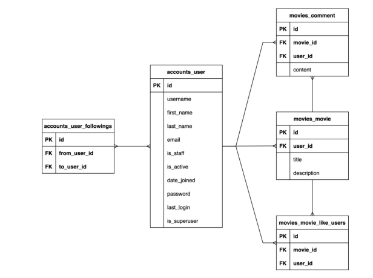

# 06_pjt

## mypjt (ver_2_movies)

### app_1 : movies
: 영화정보 생성, 조회, 수정, 삭제, 좋아요, 댓글 작성, 댓글 조회, 댓글 삭제

> Models.py
- Movie class
  - user -> ForeignKey, User모델 새로 설정(settings에서 import), 삭제오류 해결: on_delete=models.CASCADE 
  - N:M 모델 like_users는 ManyToManyField를 이용, User모델 설정, 역참조 모델 이름 설정해주기
- Comment class
  - user -> ForeignKey설정
  - movie -> ForeignKey설정, 참조-Movie 클래스

> views.py

### app_2 : accounts
: 로그인, 로그아웃, 회원가입, 회원탈퇴, 회원정보 수정, 비밀번호 수정, 팔로우

> Models.py
- AbstactUser모델 클래스 상속, 
- followings 생성