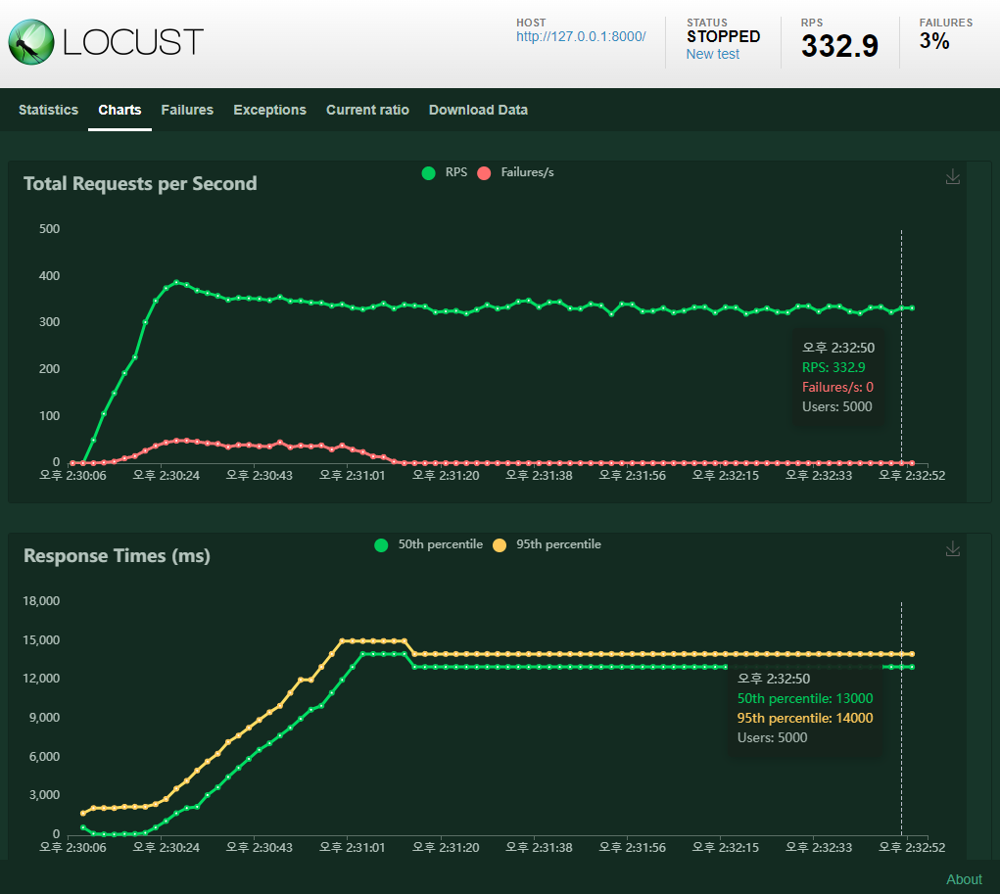
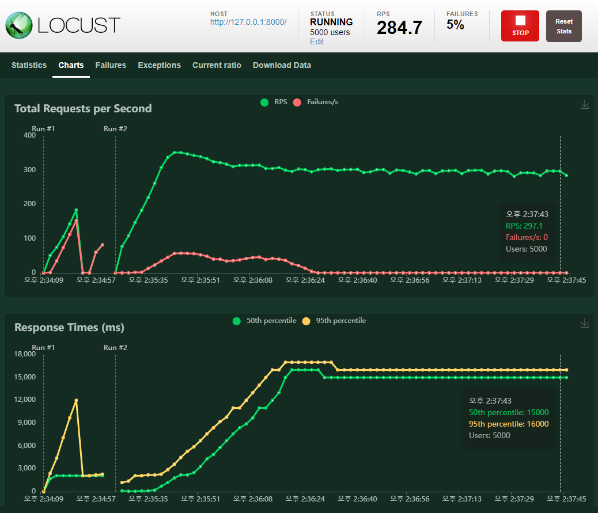
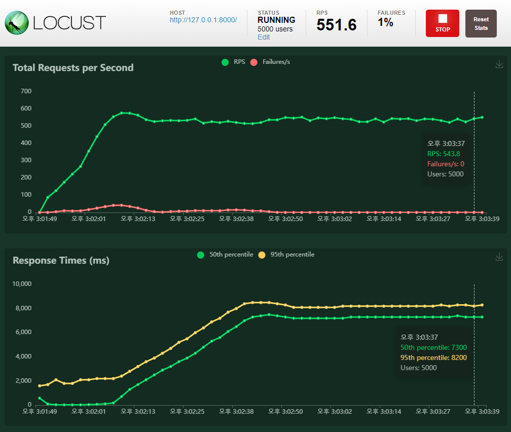

# 08_pjt

## 트랙 : 금융

## 팀원 : 김온유, 유병욱
## 팀장 : 유병욱

# Driver / navigator 교체 조건
각 세부 요구사항을 하나씩 해결할 때 마다 변경
+ 자신 있는 코드 작성이 있는 경우, 해당 인원이 navigator로 방향성을 지시하고, driver가 코딩을 하는 동안 이후의 요소도 정리/설계함.
+ 의사코드 / 대략적 코드 설계가 완료되고, 진행이 가능한 시점에 설명 후 driver - Nav. 교체

# 사전준비
1. git 생성
2. .gitignore 파일 추가
3. Django 프로젝트 생성 후 app 등록

# 명세
A. CSV 데이터를 DataFrame 으로 변환 후 반환
  1. data/test_data.CSV를 Django 에서 읽어오기
  2. Numpy 혹은 Pandas 의 CSV 를 읽어오는 함수를 활용하여 완성

B. 결측치 처리 후 데이터 반환
  1. Pandas 라이브러리의 특정 값 반환 함수를 활용하여 DataFrame 을 반환
    - (단, 비어 있는 값을 “NULL” 문자열로 치환 )

C. 알고리즘 구현하기(평균 나이와 가장 비슷한 10명)
  1. DataFrame 의 “나이” 필드를 활용, 나이 필드의 평균값 구하기
  2. 평균 나이와 가장 비슷한 나이인 10개 행을 새로운 DataFrame 으로 만들어 반환
    - 평균값을 구할 수 있도록 DataFrame 을 전역 변수로 선언
    - 결측치를 제외한 데이터들에 대하여 평균을 계산
  3. 각 행과 평균값의 차이를 구한 후, 절대값을 취하여 새로운 필드로 만들기
  4. 새로 생성한 필드를 기준으로 가장 작은 10개의 행을 선택
  5. 선택된 10개의 행을 JSON 형태로 응답합니다.

D. Loucst 를 활용한 알고리즘 성능 측정
  1. C에서 만든것 이어서 활용
  2. C 번의 함수를 테스트 할 수 있도록 Locust 스크립트 파일을 작성
  3. 총 접속자 수와 동시 접속자 수를 변경하며 여러 번 성능 테스트를 시도
    - “총 접속자, 동시 접속자, 평균 RPS, 응답 시간“ md 기록 필요
  4. 다른 사람들이 구현한 알고리즘과 나의 알고리즘의 성능을 비교
  5. 나의 알고리즘과 성능 차이가 나는 이유를 분석하여 README.md 에 작성

# 구현과정
1. settings.py
   - APP (test) 등록

2. URL 설정
   - A, B, C 를 위한 URL 주소 3개 지정

3. Viewdf (CSV 데이터를 DataFrame 으로 변환 후 반환)
     - pandas를 import 해준 뒤 read_csv로 CSV파일 읽어왔습니다.
     - 파일 로딩시 글자가 깨지는 경우를 방지하기 위해 encoding='cp949' 을 추가해 주었습니다.
     - 데이터를 딕셔너리에 담아 JsonResponse 를 통해 반환해 주었습니다.
  
   - B. handle_null (결측치 처리 후 데이터 반환)
     - 결측치가 있는 데이터를 처리하기 위해 fillna함수를 사용하여 결측값을 다른 값(NULL)로 바꾸어주었습니다.
  
   - C. age_avg (평균나이와 비슷한 10명 알고리즘 구현)
     - 평균 나이를 구하기 위해 dropna함수를 이용해 나이행의 결측치가 있는 부분을 버려주었습니다.
     - 나이필드의 평균값을 구하여 avg_df변수에 선언하였습니다.
     - 각 행과 평균갑의 차이를 구한 뒤 '차이'라는 새로운 필드를 만들어 추가했습니다.
     - 새로 만든 '차이'필드를 기준으로 정렬을 시켜주었습니다.
     - head함수를 이용해 평균값과 나이의 차이가 가장 작은 10개의 행을 선택했습니다.
     - 선택된 10개의 행을 새로운 변수에 담은 뒤 딕셔너리로 변환 후 Json형태로 반환해 주었습니다.
  
   - D.
     - Number of users: 5000 / Spawn rate: 100 기준
     - test/A/ 에 요청 보냈을 때
      

     - test/B/ 에 요청 보냈을 때
      

     - test/C/ 에 요청 보냈을 때 
      

     - ㅇㅂㅇ
     - 