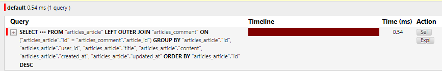

# 2023_10_17

# 팔로우

## 프로필

## User(M) - User(N)
0명 이상의 회원은 0명 이상의 회원과 관련  

회원은 0명 이상의 팔로워를 가질 수 잇고, 0명 이상의 다른 회원들을 팔로잉할 수 있음

| 행동 | 연결관계 | 상태 |
|--------|----|----|
|1 -> 2 팔로우  | 1 -> 2 | 단방향 |
|2 -> 1 팔로우  | 1 <-> 2 | 맞팔 |

---

### 팔로우 기능 구현

코드 : [accounts/models.py 클래스 수정](./한일.md/#클래스-수정)

1. manytomanyfield 작성
- 참조   
   - 내가 팔로우하는 사람들(팔로잉, followings)
- 역참조  
   - 상대방 입장에서 나는 팔로워 중 한명  
*바뀌어도 상관 없으나 관계 조회시 생각하기 편한 방향으로*

self쓰는 대표적 경우 : 대댓글

구현이 힘들다면 articles의 likes 참조 

### 뭔가 뭔가 뭔가 필요할지도 뭔가
.exists
- 큰 목록 안에서 한가지를 찾을 떄 유용하다.
- QuerySet에 결과가 포함되어 있으면 True를 반환하고, 결과가 포함되어 잇지 않으면 False를 반환
- 큰 QuerySet에 있는 특정 객체 검색에 유용하다.

### Fixtures
- Django가 데이터베이스로 가져오는 방법을 알고 있는 데이터 모음
> 데이터 베이스 구조에 맞추어 작성되어 있음
> db 자체는 공유하지 않으나, db에 들어있는 데이터를 공유할 수 있다. 이를 fixtures라고 한다.
> django가 만들어야 한다.
- 목적 : 초기 데이터의 제공
  


: django 프로젝트의 앱을 처음 설정할 떄 동일하게 준비 된 데이터로 데이터베이스를 미리 채우는 것이 필요한 순간이 있다.
> fixtures를 사용해 앱에 초기 데이터(initail data)를 제공

#### fixtures 관련 명령어

앱이름  모델이름

###### dumpdata : 생성 (데이터 추출)
- 데이터베이스의 모든 데이터를 추출, json으로 주는 듯
- 한글 json에서 깨지긴 하는데 괜찮아요
  

python manage.py dumpdata --indent 4 articles.article > articles.json
> 게시글에 대한 데이터 추출
> 장고가 알아서 잘 만들어줍니다
user 추출
python manage.py dumpdata --indent 4 accounts.user > users.json
comment
python manage.py dumpdata --indent 4 articles.comments > comments.json

##### loaddata : 로딩 (데이터 입력)

#### Fixture 파일 기본 경로
app_name/fixtures 입니다. // 약속된 경로가 있음
load 는 fixtures 이후의 경로

```bash
python manage.py loaddata articles.json users.json comments.json
# 와 한번에 여러개 된다! 
# 결과 : Installed 14 object(s) from 3 fixture(s)
```

encoding codec 관련 에러 해결법 ....


1. dumpdata 하는 시점 : python -Xutf8 manage.py dumpdata [~~~~]
2. 메모장 활용
   1. 메모장으로 json 열기
   2. 다른이름으로 저장 
   3. 인코딩 - UTF-8
이것저것 넣기 좋네요. 자동 덤프는 없. 최신으로 유지를 하거나~

##### load 주의사항:
- 만약 한번에 loaddata를 실행하지 않고 하나씩 한다면 모델 관계에 따라서 load 하는 순서가 중요할 수 있다.
  - comment는 article에 대한 key 및 user에 대한 key 필요
  - article은 user에 대한 key 필요
- 즉 현재 모델 관계에서는 user -> article -> comment 순으로 loaddata를 해야 오류가 발생하지 않음
- **한번에 하면 Django가 해결**


모든 모델 한번에 Dump
앱이름 클래스 이름.... 잘 비비믄 댐
싹다 생략하면 모든 모델을 만들어줌 

##### 모든 모델을 하나의 json 파일로
```bash
python -Xutf8 manage.py dumdata --indent 4 > data.json
```
Fixtures 파일을 직접 만들지 말 자. 
> 스크립트 짜지 말고, Django가 dump 해줄 것입니다. 
> > 반 드 시 dumpdata 명령어를 사용해서 생성!!!!!!!!!!!!!!! 반드시!!!!!!!!


## Improve query 
ORM
article.objects.all() -> SQL -> 쿼리쿼리 -> DB
같은 결과를 얻기 위해 DB측에 보내는 쿼리 개수를 점차 줄여 조회하기

[99 번 pjt 로 이동](./한일.md/#99번-pjt)


python manage.py loaddata users.json articles.json comments.json

디버그 툴바 ㅎㄷㄷ

idx -1 
-  default 1.87 ms (12 queries including 10 similar )
-  문제 원인
-  {{ article.comment_set.count }} 이거 때문임 

중복되는 쿼리 요청
-  문제 해결
-  게시글을 조회하면서 댓글 개수까지 한번에 조회해서 가져오기

### Annotate // 주석
SQL의 GROUP BY 쿼리를 사용

views 를 봅시다. 주석 풀기 
```py

```



엄청난 개선이다!

### select_related
SQL의 INNER JOIN 쿼리를 활용
> 1:1 참조 or N:1 참조 관계에서 사용

idx -2  :  default 1.89 ms (11 queries including 10 similar and 8 duplicates )
중복코드

-문제 해결 : 게시글을 조회하면서 **유저 정보까지 한번에 조회**해서 가져오기

### prefetch_related
M:N 또는 N:1 역참조 관계에서 사용
> SQL 이 아닌 Python을 사용한 JOIN을 진행한다.  

IDX-3
또 한번에 가져오나봐요


idx - 4 
- 문제 원인
- 게시글 + 각 게시글 댓글 목록 + 댓글의 작성자를 단계적으로 평가

#### 다만 아직 data의 규모가 크지도않거니와, 다른 이슈가 있다면 그떄 조금 수정해도 될 듯합니다.
너무 거기에 집중해서 할 필요는 없을 것 같아요. 
당장필요한건아님!!!! 언젠가 필요한 날이 올수도 있음 저 문법 머지 
결과 봤으면 ㅇㅋ입니다~ 개선도 가능하구나~~ 